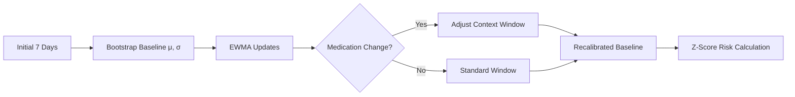
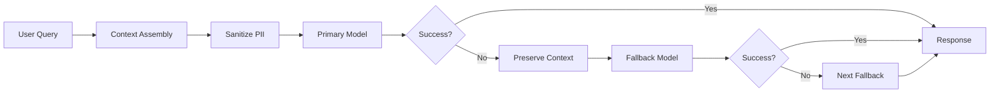
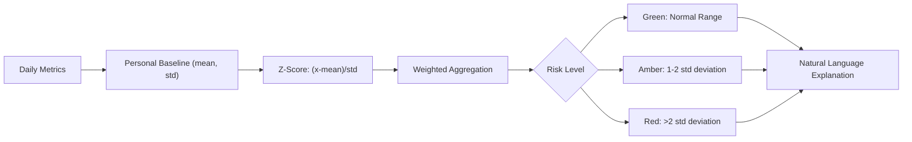

# Bipolar Guardian

**Adaptive digital phenotyping via multi-model orchestration and evolving personal baselines**

Bipolar Guardian treats personalization as architecture, not a setting. Instead of static population thresholds, it builds individual baselines that adapt to medication changes, life transitions, and personal patterns-turning "your normal vs. the population's normal" into working code.

[](https://opensource.org/licenses/MIT) [](https://github.com/bxrdy/bipolar-guardian) [](https://www.typescriptlang.org/) [](https://reactjs.org/) [](https://supabase.com/)

**Preprint:** <br>
IEEE TechRxiv: [https://doi.org/10.36227/techrxiv.175616608.83160295/v1](https://doi.org/10.36227/techrxiv.175616608.83160295/v1) | Zenodo: [https://doi.org/10.5281/zenodo.16800716](https://doi.org/10.5281/zenodo.16800716)

## New to Digital Health Projects?

If terms like "EWMA," "multi-model orchestration," or "digital phenotyping" feel unfamiliar, that's completely normal! This project sits at the intersection of mental health, technology, and data science.

**[Start here for a friendly introduction](docs/USER_GUIDE.md)** that explains the "why" and "what" behind this work in everyday language.

Already comfortable with technical concepts? Continue reading below.

## Technical Architecture

### Personal Baseline Evolution



The system uses exponentially weighted moving averages with context-aware windowing. When medication changes are detected, it temporarily shortens the effective window to emphasize post-change data while preserving historical context.

### Multi-Model Orchestration



State-preserving fallback maintains therapeutic context across model failures. When the primary model is unavailable, the system automatically switches while retaining the full conversation history and sanitized health context.

### Risk Scoring Pipeline



## Core Capabilities

### Adaptive Personalization
- **Dynamic baselines** that evolve with life changes
- **Medication-aware windowing** for accurate post-change recalibration  
- **Individual normal ranges** rather than population averages
- **Transparent Z-score calculations** with natural language explanations

### Resilient AI Integration
- **Multi-model portfolio** with automatic failover
- **Context preservation** across model switches
- **PII-minimized prompts** with sanitized health context
- **Therapeutic boundaries** with crisis resource routing

### Embedded Validation
- **Testing harness** integrated into production
- **Real-time quality assurance** during development
- **Medical terminology validation** via edge functions
- **Therapeutic response evaluation** against safety rubrics

## Getting Started

### Prerequisites
- Node.js 18+ 
- A [Supabase](https://supabase.com) account (free tier works)
- OpenRouter API key for AI models

### Quick Setup
```bash
git clone https://github.com/bxrdy/bipolar-guardian
cd bipolar-guardian
npm install
```

### Supabase Configuration

1. **Create a new Supabase project** at [database.new](https://database.new)

2. **Set up your environment variables** - Create `.env.local`:
```env
VITE_SUPABASE_URL=your_supabase_project_url
VITE_SUPABASE_ANON_KEY=your_supabase_anon_key
```

3. **Run database migrations** to set up the schema:
```bash
npx supabase link --project-ref your-project-ref
npx supabase db push
```

4. **Deploy edge functions** for AI processing:
```bash
npx supabase functions deploy
```

5. **Configure OpenRouter API key** in your Supabase project's Edge Function secrets:
```bash
npx supabase secrets set OPENROUTER_API_KEY=your_openrouter_key
```

6. **Create a test account** - Use your own email/password (no hardcoded test credentials)

7. **Start the development server**:
```bash
npm run dev
```

### Testing & Validation
Navigate to `/testing` for the comprehensive validation framework. See [complete setup guide](docs/developer/SETUP.md) for detailed testing information.

## System Architecture

### Technology Stack
- **Frontend:** React 18, TypeScript, Tailwind CSS, shadcn/ui
- **Backend:** Supabase (PostgreSQL, Auth, Edge Functions)  
- **AI Models:** Multi-provider orchestration via OpenRouter
- **Mobile:** Capacitor for iOS/Android, PWA capabilities
- **Security:** Enterprise-grade security with Row-Level Security, PII sanitization, encrypted storage, audit trails, and session hardening

### Data Pipeline
- **Sensor Integration:** Sleep, activity, mood, and medication tracking
- **Baseline Calculation:** EWMA with exponential decay (15-day half-life)
- **Risk Assessment:** Z-score aggregation with configurable weights
- **Document Analysis:** Encrypted clinical document processing
- **Validation:** Continuous quality assurance embedded in production

## Research Foundation

This implementation builds on established research in digital phenotyping and personalized mental health monitoring:

- **Digital Phenotyping:** [Onnela & Rauch (2016)](https://www.nature.com/articles/npp2016262) - foundational work on smartphone-based behavioral monitoring
- **Wearable Predictors:** [Lim et al. (2024)](https://www.nature.com/articles/s41746-024-01349-6) - sleep and circadian features for mood episode prediction  
- **Personalization Frameworks:** [Song et al. (2024)](https://mental.jmir.org/2024/1/e59512) - macro-micro approaches for individual vs. population modeling
- **Conversational AI Ethics:** [Rahsepar Meadi et al. (2025)](https://mental.jmir.org/2025/1/e60432) - scoping review of CAI in mental health care

## Development Status

Bipolar Guardian is a working MVP that validates the technical approach to adaptive personalization in mental health monitoring. The system demonstrates how exponentially weighted baselines, multi-model orchestration, and embedded validation can be integrated into a coherent user experience.

**Current Focus:** System validation and quality assurance through the embedded testing framework. While clinically inspired, this implementation prioritizes technical proof-of-concept over medical validation.

**Clinical Validation:** The current system provides development QA validation, not clinical validation. For healthcare claims, see our [evidence-based clinical validation roadmap](docs/CLINICAL_VALIDATION.md) outlining the path from current MVP to FDA-compliant medical device.

## Contributing

Contributions from developers interested in digital health, adaptive systems, UI/UX design, and human-AI interaction welcomed:

1. **Technical contributions:** Baseline algorithms, model orchestration, validation frameworks
2. **Research collaboration:** Digital phenotyping, personalization methods, conversational AI safety
3. **Clinical input:** Mental health professionals interested in reviewing therapeutic approaches

See [complete setup guide](docs/developer/SETUP.md) for detailed setup and contribution guidelines.

## Transparency & Limitations

**What this system provides:**
- Sophisticated personal baseline adaptation with transparent algorithmic reasoning
- Resilient multi-model AI guidance with clear therapeutic boundaries  
- Embedded validation harness for continuous quality improvement
- Open-source reference implementation for adaptive personalization patterns

**What this system does not provide:**
- Medical diagnosis or treatment recommendations
- Clinically validated outcomes or FDA approval
- Replacement for professional mental health care
- Production-scale deployment without additional validation

---

**Built for the intersection of human-centered design and adaptive AI systems.**

[Setup Guide](docs/developer/SETUP.md) • [Algorithms](docs/technical/ALGORITHMS.md) • [Architecture](docs/technical/ARCHITECTURE.md) • [Research Paper](https://doi.org/10.5281/zenodo.16800716)
